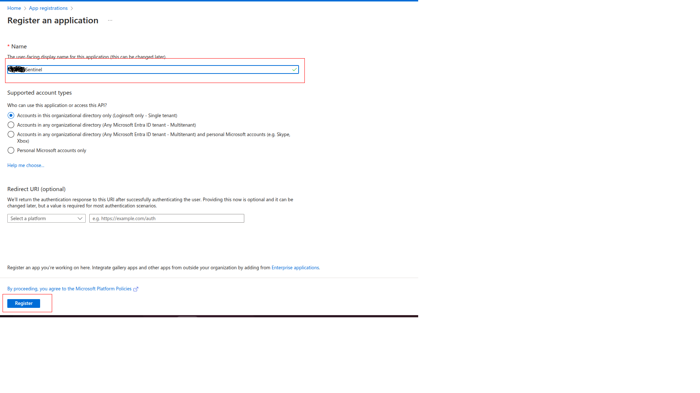
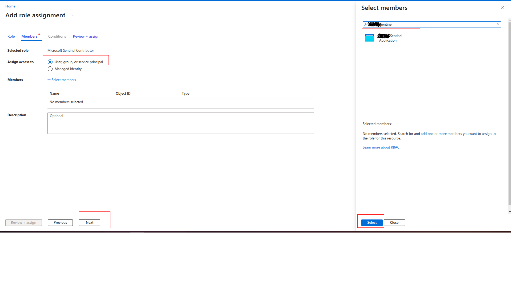
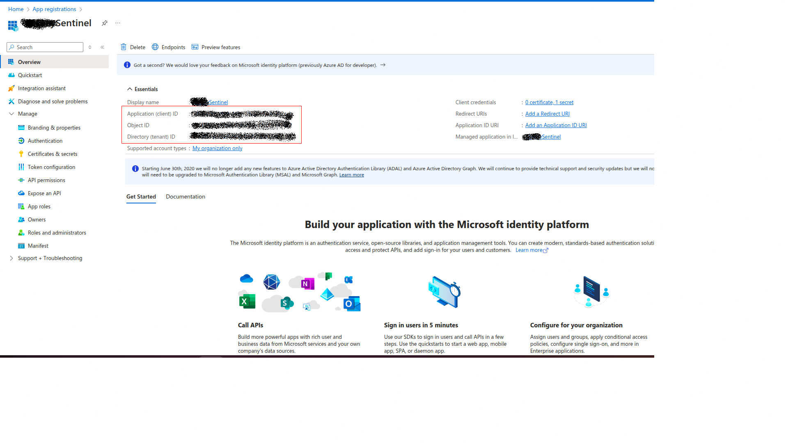
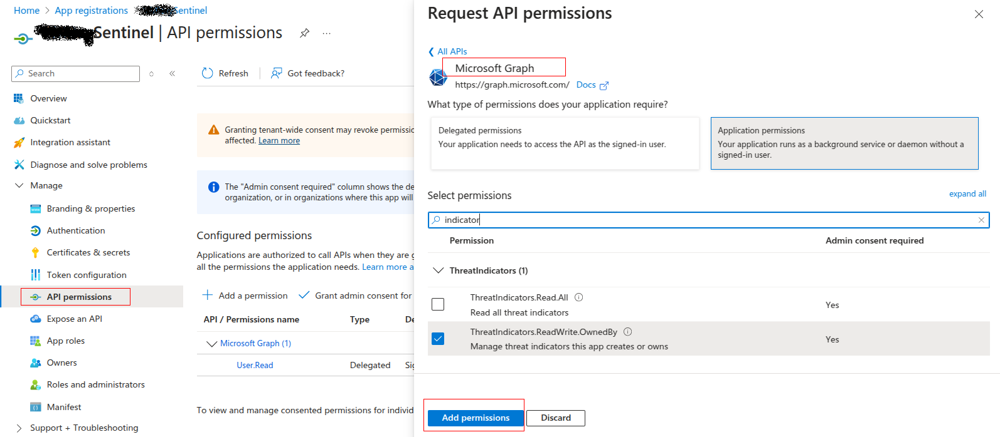
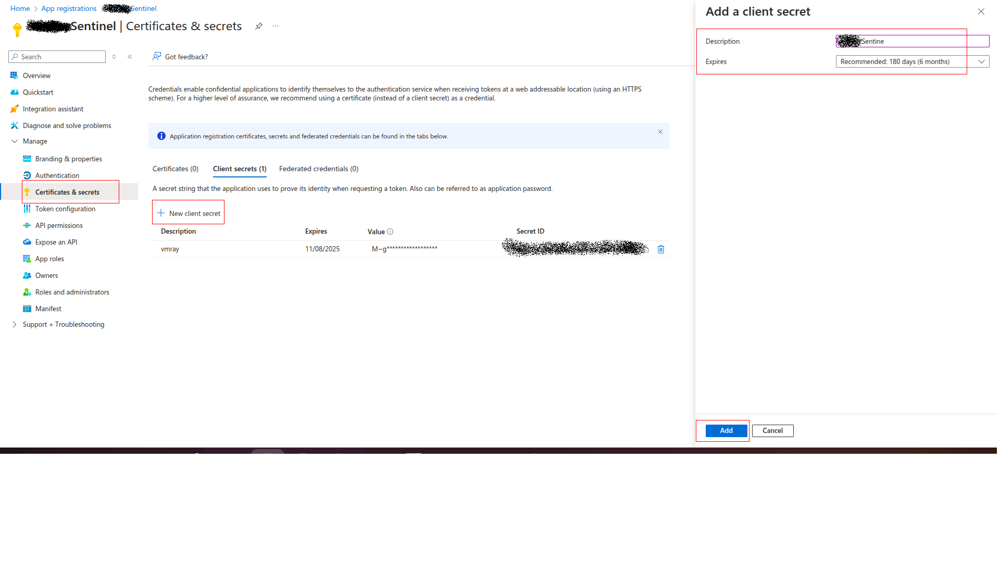
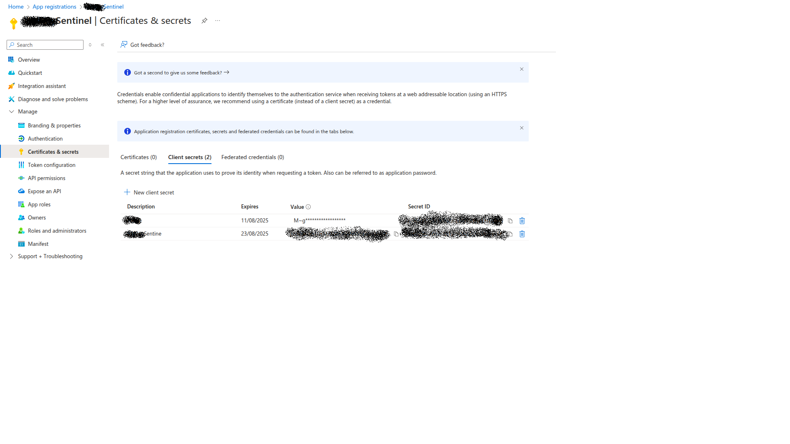
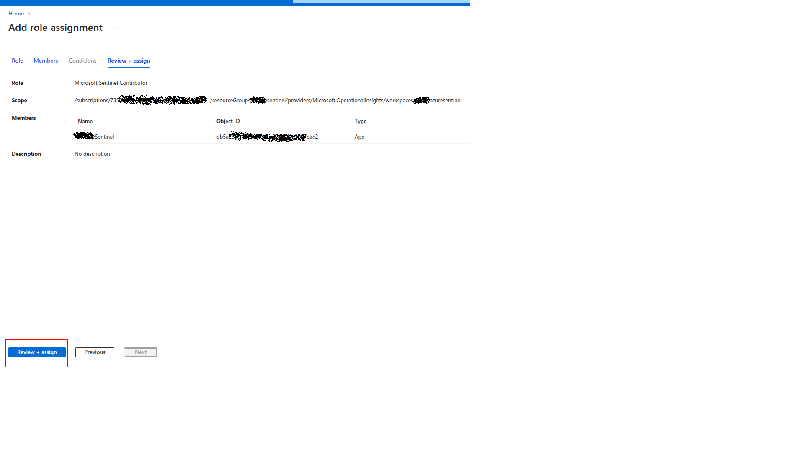
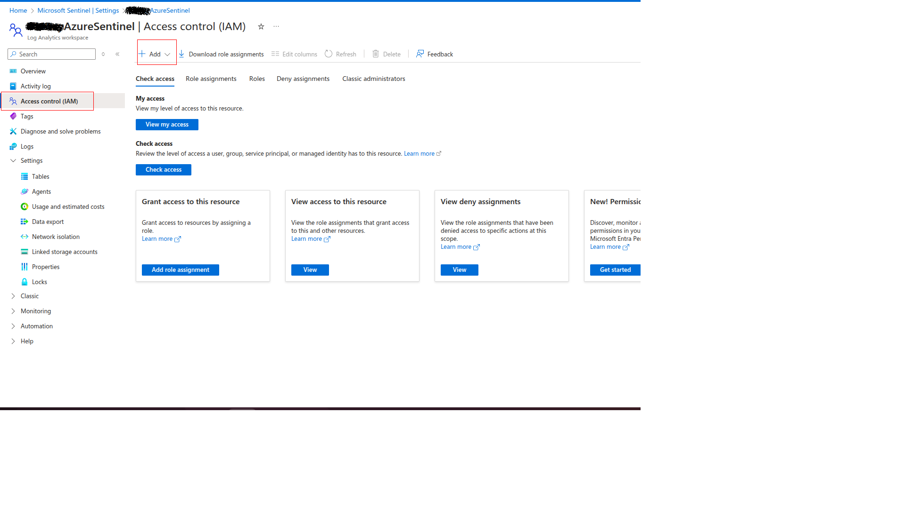

# Luminar Threat Intelligence Feed - Microsoft Sentinel

## Overview
Cognyte is a global leader in security analytics software, empowering governments and enterprises with Actionable Intelligence. Luminar, Cognyte's asset-based cybersecurity intelligence platform, enables organizations to build and maintain proactive threat intelligence operations by identifying risks before they materialize.

This connector integrates Luminar with Microsoft Sentinel, a cloud-native Security Information and Event Management platform. Microsoft Sentinel provides intelligent security analytics and threat intelligence across the enterprise, offering a single solution for attack detection, threat visibility, proactive hunting, and threat response.

By connecting Luminar to Microsoft Sentinel, organizations can automate the delivery of high-fidelity intelligence directly into their security workspace. 

This integration focuses on two primary Luminar feeds:

- *IOC Feeds*: Ingests Indicators of Compromise (such as malicious IPs, domains, URLs, hashes, email and more) to enhance real-time detection and threat-matching capabilities.

- *Leaked Records*: Ingests compromised credential data and leaked records into Sentinel, allowing security teams to identify and mitigate identity-based risks and potential account takeovers.

## Requirements
- Microsoft Sentinel.
- Luminar.
- Microsoft Azure
  1. Azure functions with Flex Consumption plan.
     Reference: https://learn.microsoft.com/en-us/azure/azure-functions/flex-consumption-plan
     
	 **Note:** Flex Consumption plans are not available in all regions, please check if the region your are deploying the function is supported, if not we suggest you to deploy the function app with premium plan.
	 Reference: https://learn.microsoft.com/en-us/azure/azure-functions/flex-consumption-how-to?tabs=azure-cli%2Cvs-code-publish&pivots=programming-language-python#view-currently-supported-regions
  2. Azure functions Premium plan.
	 Reference: https://learn.microsoft.com/en-us/azure/azure-functions/functions-premium-plan
  3. Azure storage with Standard general-purpose v2.

## Luminar Configurations

- Account ID
- Client ID
- Client Secret

     
## Microsoft Sentinel

### Creating Application for API Access

- Open [https://portal.azure.com/](https://portal.azure.com) and search `Microsoft Entra ID` service.

- Click `Add->App registration`.

- Enter the name of application and select supported account types and click on `Register`.

- In the application overview you can see `Application Name`, `Application ID` and `Tenant ID`.
 

- After creating the application, we need to set API permissions for connector. For this purpose,
  - Click `Manage->API permissions` tab
  - Click `Microsoft Graph` button
  - Search `indicator` and click on the `ThreatIndicators.ReadWrite.OwnedBy`, click `Add permissions` button below.
  - Click on `Grant admin consent`

  

- We need secrets to access programmatically. For creating secrets
  - Click `Manage->Certificates & secrets` tab
  - Click `Client secrets` tab
  - Click `New client secret` button
  - Enter description and set expiration date for secret

- Use Secret `Value` to configure connector.
  
 

## Provide Permission To App Created Above

- Open [https://portal.azure.com/](https://portal.azure.com) and search `Microsoft Sentinel` service.
- Goto `Settings` -> `Workspace Setting`

- Goto `Access Control(IAM)` -> `Add`

- Search for `Microsoft Sentinel Contributor` and click `Next`

- Select `User,group or service principle` and click on `select members`.
- Search for the app name created above and click on `select`.
- Click on `Next`

- Click on `Review + assign`

# Install Luminar Threat Intelligence Connector from Sentinel content hub

- Go to Microsoft Sentinel -> Select created workspace -> Content management -> Content hub

- Click Review+Create

- After the connector is installed, click on Manage

-Click on Open Connector page

-Click on Deploy to Azure (Flex or Premium)

- It will redirect to feed Configuration page.
  
- Please provide the values accordingly.
  
|       Fields       |   Description |
|:---------------------|:--------------------
| Subscription| Select the appropriate Azure Subscription    | 
| Resource Group | Select the appropriate Resource Group |
| Region| Based on Resource Group this will be uto populated |
| Function Name| Please provide a function name if needed to change the default value|
| Application ID   | Enter the Azure Client ID created in the App Registration Step |
| Client Secret | Enter the Azure Client Secret created in the App Registration Step |
|Tenant ID | Enter the Azure Tenant ID of the App Registration |
| Luminar API Client ID   | Enter the Luminar Client ID |
| Luminar API Account ID | Enter the Luminar Account ID |
|Luminar API Client Secret | Enter the Luminar Client Secret |
|Luminar Initial Fetch Date| Date to fetch feeds from. ex: 2026-01-01 |
|Time Interval| Connector to run in intervals |
| App Insights Workspace Resource ID | Go to `Log Analytics workspace` -> `Settings` -> `Properties`, Copy `Resource ID` |

- Once you provide the above values, please click on `Review + create` button.

- Once the threat intelligence function app connector is succussefully deployed, the connector saves the IOCS into the Microsoft Sentinel Threat Intelligence.

